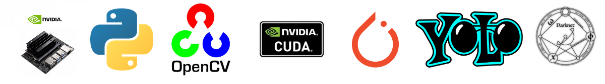
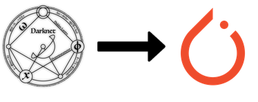
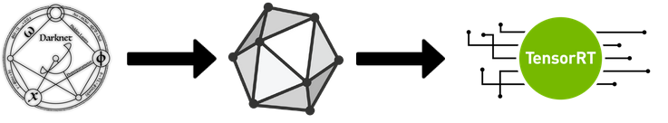

# Self Driving Robot

Right now I've only implemented stop sign detection, not traffic lights. The robot can detect and classify if the traffic light is red, yellow, or green, but it cannot act upon those decisions just yet. The specifics are in the [stop-sign branch](https://github.com/gallo-json/self-driving-robot/tree/stop-sign) of this repo.

## Powered by

## Inference
### Directly on the Jetson Nano

Inference with only the darknet `.weights` file loaded by OpenCV performs very poorly (~0.8 FPS). To better the performance convert the Darknet YOLOv4 model to a PyTorch model or to a TensorRT engine.

PyTorch model reached ~4 FPS.

FP16 TensorRT engine reached ~2 FPS.

### On the computer SSHing into the Jetson Nano

If worst comes to worst and the Nano cannot run the model smoothly, I can use my NVIDIA GPU laptop that controls the Nano. The Nano sends the live camera feed to the laptop, the laptop does all the inference then sends back the labels where then the Nano parses that and moves the motors accordingly.

## Road following

NVIDIA AI IOT already has source code for this. All that is left is to combine both models.

## Questions

### Why can't you just use YOLOv4-tiny?

Probably be better to do so. YOLOv4-tiny is much smaller than YOLOv3 but I would have to train a new model again.

### Why is the PyTorch model better than the TensorRT engine?

I have no clue, they're using same CUDA device, same inference dimensions, same YOLO cfg file, etc. But I'm not complaining since its easier to deploy alongside the other road following PyTorch model.

### If the PyTorch model is already better, can you make it even better by converting it to TensorRT?

Torch2trt natively does not support some of the layers in YOLO, which means I would have to create layer converters and I do not want to go down that rabbit hole. Maybe for a future project.

## Useful repositories

JetBot: https://github.com/NVIDIA-AI-IOT/jetbot

TensorRT demos: https://github.com/jkjung-avt/tensorrt_demos

YOLO in PyTorch: https://github.com/ultralytics/yolov3/tree/archive
