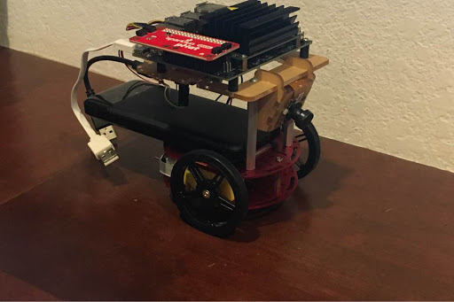

# Self Driving Robot

Using a Jetbot (Sparkfun kit).
[NVIDIA JetBot repository](https://github.com/NVIDIA-AI-IOT/jetbot)

## Track

Can follow the roads using code in the [JetBot repo](https://github.com/NVIDIA-AI-IOT/jetbot/tree/master/notebooks/road_following) but not avoid any obstacles.

## Obstacles 

- Traffic lights

They will be controlled by an arduino

- Stop signs
- Other toy cars in front
- Pedestrains