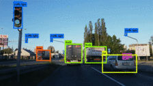

# Self Driving Robot

## Motivation

I wanted to see if I could build a miniature version of a self-driving car: a robot that could detect obstacles, stop on stop signs, wait on traffic lights, etc. Of course, this scaled-down project is much simpler than a real self-driving car, but the experience was fun.

## Overview

The goals for this self-driving robot were:

- To stop and wait 2 seconds at a stop sign
- To stop at a red light, and wait until the light turns green
- To continue moving forward at a green light
- To follow the road at all times

Detecting the stop signs as well as a red, yellow, or green traffic light can be done with one YOLO model. NVIDIA has open-source code for the road following part, which is done using a ResNet model. Combining both enables me to achieve all of the above tasks. 

I was successful in completing all these tasks individually, but never managed to put them all together. I am still satisfied with the final product. I explain why in my [reflection](resources/Reflection.md), as well as other obstacles I faced.

## Results

Video: https://www.youtube.com/watch?v=9wnvsFO_PbQ

## Powered by

The NVIDIA JetBot is a small robot kit that comes with the powerful NVIDIA Jetson Nano.

### Tech Stack

- OpenCV: For computer vision
- PyTorch: For loading the YOLO and ResNet models and inference
- JetBot library: For interfacing with the motors

## Training

I trained the YOLOv3 model on the Google Cloud, using pictures of real stop signs & traffic lights, as well as the ones I took of my miniature versions. This way I get more variety and so the robot can detect my scaled-down versions of these obstacles.

The weight files for the models are too large therefore I cannot include them in this repo.

## Inference
### Directly on the Jetson Nano

Inference with only the darknet `.weights` file loaded by OpenCV performs very poorly (~0.8 FPS). To better the performance convert the Darknet YOLOv4 model to a PyTorch model or to a TensorRT engine.

PyTorch model reached ~4 FPS.

FP16 TensorRT engine reached ~2 FPS.

### On the computer SSHing into the Jetson Nano

If worst comes to worst and the Nano cannot run the model smoothly, I can use my NVIDIA GPU laptop that controls the Nano. The Nano sends the live camera feed to the laptop, the laptop does all the inference then sends back the labels where then the Nano parses that and moves the motors accordingly.

## Questions

### Why can't you just use YOLOv4-tiny?

Probably be better to do so. YOLOv4-tiny is much smaller than YOLOv3 but I would have to train a new model again.

### Why is the PyTorch model better than the TensorRT engine?

I have no clue, they're using same CUDA device, same inference dimensions, same YOLO cfg file, etc. But I'm not complaining since its easier to deploy alongside the other road following PyTorch model.

### If the PyTorch model is already better, can you make it even better by converting it to TensorRT?

Torch2trt natively does not support some of the layers in YOLO, which means I would have to create layer converters and I do not want to go down that rabbit hole. Maybe for a future project.

## Useful repositories and helpful links

JetBot: https://github.com/NVIDIA-AI-IOT/jetbot

TensorRT demos: https://github.com/jkjung-avt/tensorrt_demos

YOLO in PyTorch: https://github.com/ultralytics/yolov3/tree/archive

YOLO with Jetson Nano Camera Protocol: https://github.com/gallo-json/yolov3-jetson-nano 

JetCam: https://github.com/NVIDIA-AI-IOT/jetcam

Training custom YOLOv3 model with Google Cloud: https://www.youtube.com/watch?v=10joRJt39Ns 
